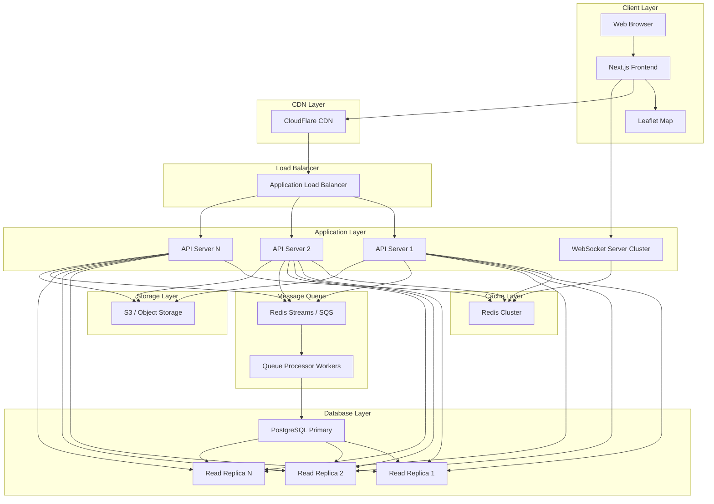
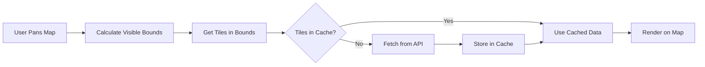
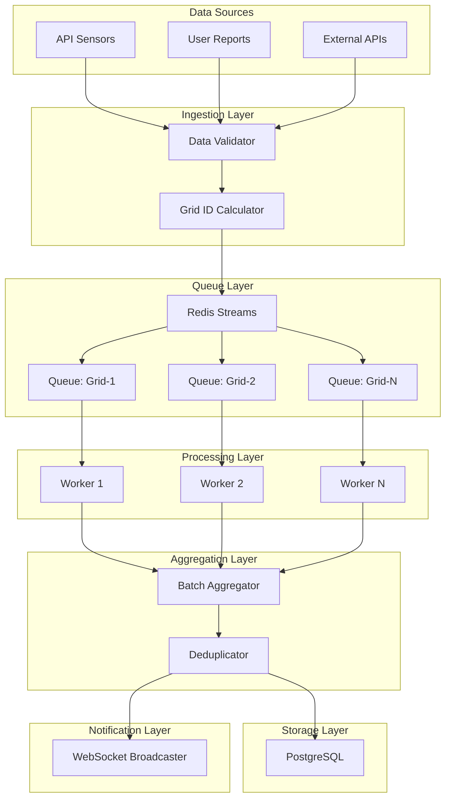
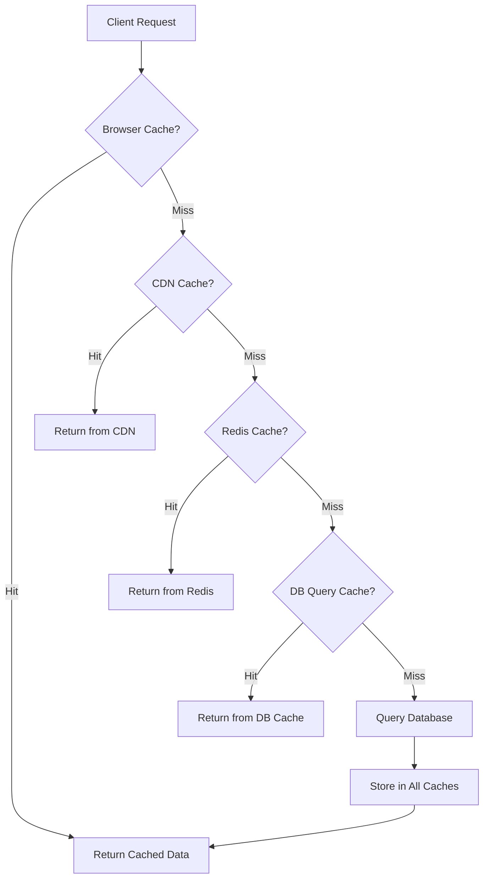
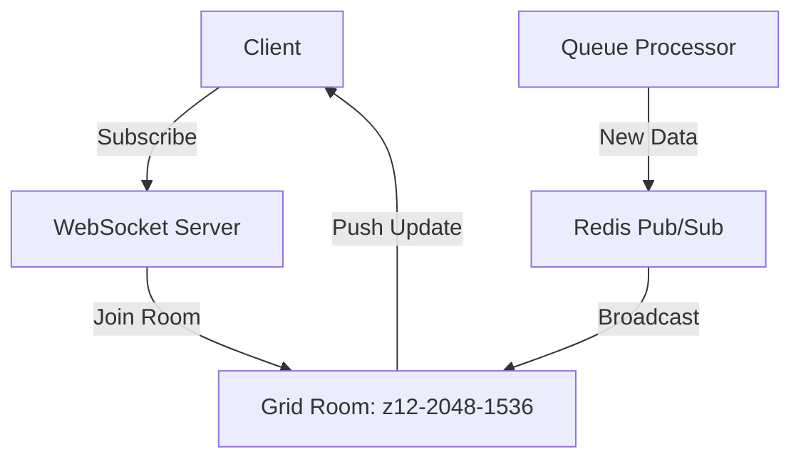
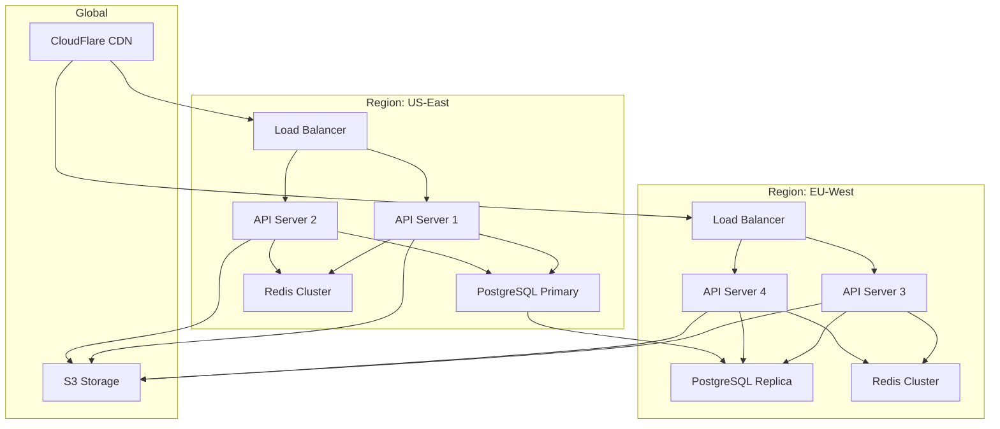
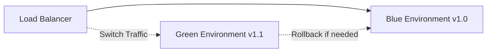

# UrbanOS - High-Scale System Design

## Table of Contents
1. [Architecture Overview](#1-architecture-overview)
2. [Grid-Based Data Partitioning](#2-grid-based-data-partitioning)
3. [Queue-Based Update System](#3-queue-based-update-system)
4. [Caching Architecture](#4-caching-architecture)
5. [Database Design](#5-database-design)
6. [API Architecture](#6-api-architecture)
7. [Real-Time Updates](#7-real-time-updates)
8. [Infrastructure](#8-infrastructure)
9. [Monitoring & Observability](#9-monitoring--observability)
10. [Deployment Strategy](#10-deployment-strategy)

---

## 1. Architecture Overview

### 1.1 High-Level Architecture



### 1.2 Design Principles

> [!IMPORTANT]
> **Core Design Principles for Handling Millions of Requests**

1. **Grid-Based Partitioning**: Divide the map into grids to limit data transfer
2. **Lazy Loading**: Load only visible grids on-demand
3. **Aggressive Caching**: Multi-layer caching (browser, CDN, Redis, DB)
4. **Queue-Based Updates**: Batch and process updates asynchronously
5. **Horizontal Scaling**: Scale application servers independently
6. **Read Replicas**: Distribute read load across multiple databases
7. **WebSocket Optimization**: Subscribe only to visible grids

---

## 2. Grid-Based Data Partitioning

### 2.1 Grid System Design

#### 2.1.1 Tile Coordinate System

We use the **Web Mercator projection** (same as Google Maps, OpenStreetMap) to divide the world into tiles.

```typescript
// Grid ID Format: "z{zoom}-x{x}-y{y}"
// Example: "z12-2048-1536" (zoom 12, tile x=2048, y=1536)

interface TileCoordinate {
  x: number;      // Tile X coordinate
  y: number;      // Tile Y coordinate
  z: number;      // Zoom level
}

interface GridBounds {
  minLat: number;
  maxLat: number;
  minLng: number;
  maxLng: number;
}
```

#### 2.1.2 Zoom Level Strategy

| Zoom Level | Grid Size | Coverage | Use Case | Data Points/Grid |
|------------|-----------|----------|----------|------------------|
| 10-11 | ~11 km | City-wide | Overview | 10-50 |
| 12-13 | ~1.1 km | District | Moderate detail | 50-200 |
| 14-15 | ~111 m | Neighborhood | High detail | 200-1000 |
| 16-18 | ~11 m | Street-level | Maximum detail | 1000+ |

#### 2.1.3 Grid Calculation Functions

```typescript
// Convert lat/lng to tile coordinates
export function latLngToTile(lat: number, lng: number, zoom: number): TileCoordinate {
  const n = Math.pow(2, zoom);
  const x = Math.floor(((lng + 180) / 360) * n);
  const latRad = (lat * Math.PI) / 180;
  const y = Math.floor(
    ((1 - Math.log(Math.tan(latRad) + 1 / Math.cos(latRad)) / Math.PI) / 2) * n
  );
  return { x, y, z: zoom };
}

// Convert tile to bounding box
export function tileToBounds(x: number, y: number, z: number): GridBounds {
  const n = Math.pow(2, z);
  
  const minLng = (x / n) * 360 - 180;
  const maxLng = ((x + 1) / n) * 360 - 180;
  
  const n2 = Math.PI - (2 * Math.PI * y) / n;
  const maxLat = (180 / Math.PI) * Math.atan(0.5 * (Math.exp(n2) - Math.exp(-n2)));
  
  const n3 = Math.PI - (2 * Math.PI * (y + 1)) / n;
  const minLat = (180 / Math.PI) * Math.atan(0.5 * (Math.exp(n3) - Math.exp(-n3)));
  
  return { minLat, maxLat, minLng, maxLng };
}

// Get all tiles in viewport
export function getTilesInBounds(bounds: GridBounds, zoom: number): TileCoordinate[] {
  const minTile = latLngToTile(bounds.maxLat, bounds.minLng, zoom);
  const maxTile = latLngToTile(bounds.minLat, bounds.maxLng, zoom);
  
  const tiles: TileCoordinate[] = [];
  for (let x = minTile.x; x <= maxTile.x; x++) {
    for (let y = minTile.y; y <= maxTile.y; y++) {
      tiles.push({ x, y, z: zoom });
    }
  }
  return tiles;
}
```

### 2.2 Viewport-Based Loading

#### 2.2.1 Loading Strategy



#### 2.2.2 Preloading Adjacent Grids

```typescript
// Preload adjacent tiles for smooth panning
function preloadAdjacentTiles(visibleTiles: TileCoordinate[]): TileCoordinate[] {
  const preloadTiles: TileCoordinate[] = [];
  
  visibleTiles.forEach(tile => {
    // Preload 8 surrounding tiles
    for (let dx = -1; dx <= 1; dx++) {
      for (let dy = -1; dy <= 1; dy++) {
        if (dx === 0 && dy === 0) continue; // Skip center (already visible)
        preloadTiles.push({
          x: tile.x + dx,
          y: tile.y + dy,
          z: tile.z
        });
      }
    }
  });
  
  return preloadTiles;
}
```

#### 2.2.3 Memory Management

```typescript
// Unload tiles outside viewport + buffer
function unloadDistantTiles(
  loadedTiles: Set<string>,
  visibleTiles: TileCoordinate[],
  bufferDistance: number = 2
): Set<string> {
  const visibleSet = new Set(visibleTiles.map(getTileId));
  const adjacentSet = new Set(
    preloadAdjacentTiles(visibleTiles).map(getTileId)
  );
  
  const tilesToKeep = new Set<string>();
  
  loadedTiles.forEach(tileId => {
    if (visibleSet.has(tileId) || adjacentSet.has(tileId)) {
      tilesToKeep.add(tileId);
    }
  });
  
  return tilesToKeep;
}
```

---

## 3. Queue-Based Update System

### 3.1 Update Flow Architecture



### 3.2 Queue Implementation

#### 3.2.1 Redis Streams Configuration

```typescript
// Queue configuration
const QUEUE_CONFIG = {
  streamName: 'urbanos:updates',
  consumerGroup: 'update-processors',
  batchSize: 1000,
  processingInterval: 10000, // 10 seconds
  maxRetries: 3,
  deadLetterQueue: 'urbanos:updates:dlq'
};

// Add data to queue
async function enqueueUpdate(gridId: string, data: any) {
  await redis.xadd(
    QUEUE_CONFIG.streamName,
    '*', // Auto-generate ID
    'gridId', gridId,
    'data', JSON.stringify(data),
    'timestamp', Date.now(),
    'priority', data.priority || 5
  );
}
```

#### 3.2.2 Queue Processor Worker

```typescript
// Worker that processes queue every 10 seconds
class QueueProcessor {
  private interval: NodeJS.Timeout;
  
  async start() {
    // Create consumer group if not exists
    await this.createConsumerGroup();
    
    // Process queue every 10 seconds
    this.interval = setInterval(async () => {
      await this.processBatch();
    }, QUEUE_CONFIG.processingInterval);
  }
  
  async processBatch() {
    // Read batch from queue
    const messages = await redis.xreadgroup(
      'GROUP', QUEUE_CONFIG.consumerGroup,
      'consumer-' + process.pid,
      'COUNT', QUEUE_CONFIG.batchSize,
      'BLOCK', 1000,
      'STREAMS', QUEUE_CONFIG.streamName, '>'
    );
    
    if (!messages || messages.length === 0) return;
    
    // Group by grid ID
    const updatesByGrid = this.groupByGrid(messages);
    
    // Process each grid's updates
    for (const [gridId, updates] of Object.entries(updatesByGrid)) {
      await this.processGridUpdates(gridId, updates);
    }
    
    // Acknowledge processed messages
    await this.acknowledgeMessages(messages);
  }
  
  async processGridUpdates(gridId: string, updates: any[]) {
    // 1. Deduplicate
    const uniqueUpdates = this.deduplicate(updates);
    
    // 2. Aggregate
    const aggregated = this.aggregate(uniqueUpdates);
    
    // 3. Insert to database
    await this.insertToDatabase(gridId, aggregated);
    
    // 4. Invalidate cache
    await this.invalidateCache(gridId);
    
    // 5. Broadcast to WebSocket subscribers
    await this.broadcastUpdate(gridId, aggregated);
  }
  
  deduplicate(updates: any[]): any[] {
    const seen = new Map();
    return updates.filter(update => {
      const key = `${update.location.lat},${update.location.lng},${update.type}`;
      if (seen.has(key)) return false;
      seen.set(key, true);
      return true;
    });
  }
  
  aggregate(updates: any[]): any {
    // Calculate average AQI, max pollution, etc.
    return {
      count: updates.length,
      avgAqi: updates.reduce((sum, u) => sum + u.aqi, 0) / updates.length,
      maxAqi: Math.max(...updates.map(u => u.aqi)),
      timestamp: new Date()
    };
  }
}
```

### 3.3 Priority Queue for Alerts

```typescript
// High-priority updates (alerts) bypass the 10-second queue
async function enqueueHighPriorityUpdate(gridId: string, data: any) {
  // Add to priority queue
  await redis.zadd(
    'urbanos:priority-queue',
    Date.now(), // Score = timestamp
    JSON.stringify({ gridId, data })
  );
  
  // Trigger immediate processing
  await this.processHighPriorityQueue();
}

async function processHighPriorityQueue() {
  // Get all high-priority items
  const items = await redis.zrange('urbanos:priority-queue', 0, -1);
  
  for (const item of items) {
    const { gridId, data } = JSON.parse(item);
    
    // Process immediately
    await this.processGridUpdates(gridId, [data]);
    
    // Remove from queue
    await redis.zrem('urbanos:priority-queue', item);
  }
}
```

---

## 4. Caching Architecture

### 4.1 Multi-Layer Caching Strategy



### 4.2 Cache Configuration

| Layer | TTL | Invalidation | Use Case |
|-------|-----|--------------|----------|
| **Browser** | 30s | Time-based | Reduce network requests |
| **CDN** | 10s | Time + Event | Reduce API load |
| **Redis** | 5s | Event-based | Fast data access |
| **PostgreSQL** | N/A | Query plan cache | Query optimization |

### 4.3 Cache Implementation

#### 4.3.1 Redis Cache Layer

```typescript
// Cache key format: "grid:{gridId}:{dataType}"
const CACHE_TTL = {
  gridData: 5,        // 5 seconds
  aggregated: 10,     // 10 seconds
  historical: 300     // 5 minutes
};

async function getCachedGridData(gridId: string): Promise<any | null> {
  const cacheKey = `grid:${gridId}:data`;
  const cached = await redis.get(cacheKey);
  
  if (cached) {
    return JSON.parse(cached);
  }
  
  return null;
}

async function setCachedGridData(gridId: string, data: any) {
  const cacheKey = `grid:${gridId}:data`;
  await redis.setex(
    cacheKey,
    CACHE_TTL.gridData,
    JSON.stringify(data)
  );
}

async function invalidateGridCache(gridId: string) {
  const cacheKey = `grid:${gridId}:data`;
  await redis.del(cacheKey);
  
  // Also invalidate CDN cache via purge API
  await purgeCDNCache(`/api/v1/grids/${gridId}/data`);
}
```

#### 4.3.2 CDN Cache Headers

```typescript
// API response with cache headers
export async function GET(request: Request) {
  const { gridId } = params;
  const data = await getGridData(gridId);
  
  return new Response(JSON.stringify(data), {
    headers: {
      'Content-Type': 'application/json',
      'Cache-Control': 'public, max-age=10, s-maxage=10, stale-while-revalidate=5',
      'CDN-Cache-Control': 'max-age=10',
      'Vary': 'Accept-Encoding',
      'ETag': generateETag(data)
    }
  });
}
```

#### 4.3.3 Browser Cache (Service Worker)

```typescript
// Service worker for offline caching
self.addEventListener('fetch', (event) => {
  if (event.request.url.includes('/api/v1/grids/')) {
    event.respondWith(
      caches.open('grid-cache-v1').then(cache => {
        return cache.match(event.request).then(response => {
          const fetchPromise = fetch(event.request).then(networkResponse => {
            // Update cache with fresh data
            cache.put(event.request, networkResponse.clone());
            return networkResponse;
          });
          
          // Return cached data immediately, update in background
          return response || fetchPromise;
        });
      })
    );
  }
});
```

---

## 5. Database Design

### 5.1 Table Schema

#### 5.1.1 Pollution Data Table (Partitioned)

```sql
CREATE TABLE pollution_data (
    id UUID PRIMARY KEY DEFAULT gen_random_uuid(),
    grid_id VARCHAR(50) NOT NULL,
    location GEOMETRY(Point, 4326) NOT NULL,
    timestamp TIMESTAMPTZ NOT NULL DEFAULT NOW(),
    
    -- Pollution metrics
    aqi_value FLOAT,
    pm25_aqi FLOAT,
    pm10_aqi FLOAT,
    o3_aqi FLOAT,
    no2_aqi FLOAT,
    so2_aqi FLOAT,
    co_aqi FLOAT,
    
    -- Metadata
    source VARCHAR(50),
    pollution_type VARCHAR(50),
    level INTEGER,
    
    -- Partitioning key
    created_date DATE NOT NULL DEFAULT CURRENT_DATE
) PARTITION BY RANGE (created_date);

-- Create partitions for each day (automated)
CREATE TABLE pollution_data_2026_02_04 PARTITION OF pollution_data
    FOR VALUES FROM ('2026-02-04') TO ('2026-02-05');

-- Composite index for fast grid queries
CREATE INDEX idx_pollution_grid_time ON pollution_data (grid_id, timestamp DESC);

-- Spatial index for bounding box queries
CREATE INDEX idx_pollution_location ON pollution_data USING GIST (location);

-- Index for time-based queries
CREATE INDEX idx_pollution_timestamp ON pollution_data (timestamp DESC);
```

#### 5.1.2 Grid Metadata Table

```sql
CREATE TABLE grid_metadata (
    grid_id VARCHAR(50) PRIMARY KEY,
    zoom_level INTEGER NOT NULL,
    bounds GEOMETRY(Polygon, 4326) NOT NULL,
    center GEOMETRY(Point, 4326) NOT NULL,
    
    -- Statistics (updated periodically)
    data_count INTEGER DEFAULT 0,
    avg_aqi FLOAT,
    max_aqi FLOAT,
    last_updated TIMESTAMPTZ,
    
    -- Spatial index
    CONSTRAINT valid_zoom CHECK (zoom_level BETWEEN 10 AND 18)
);

CREATE INDEX idx_grid_bounds ON grid_metadata USING GIST (bounds);
CREATE INDEX idx_grid_zoom ON grid_metadata (zoom_level);
```

### 5.2 Database Functions

#### 5.2.1 Get Data in Bounding Box

```sql
-- Optimized function to get pollution data in bounds
CREATE OR REPLACE FUNCTION get_pollution_in_bounds(
    min_lat FLOAT,
    max_lat FLOAT,
    min_lng FLOAT,
    max_lng FLOAT,
    max_results INTEGER DEFAULT 1000
)
RETURNS TABLE (
    id UUID,
    grid_id VARCHAR,
    lat FLOAT,
    lng FLOAT,
    aqi_value FLOAT,
    timestamp TIMESTAMPTZ
)
LANGUAGE SQL
STABLE
AS $$
    SELECT 
        id,
        grid_id,
        ST_Y(location) as lat,
        ST_X(location) as lng,
        aqi_value,
        timestamp
    FROM pollution_data
    WHERE location && ST_MakeEnvelope(min_lng, min_lat, max_lng, max_lat, 4326)
        AND timestamp > NOW() - INTERVAL '24 hours'
    ORDER BY timestamp DESC
    LIMIT max_results;
$$;
```

#### 5.2.2 Get Clustered Data (Low Zoom)

```sql
-- Function to get aggregated clusters for low zoom levels
CREATE OR REPLACE FUNCTION get_pollution_clusters_in_bounds(
    min_lat FLOAT,
    max_lat FLOAT,
    min_lng FLOAT,
    max_lng FLOAT,
    grid_size FLOAT
)
RETURNS TABLE (
    lat FLOAT,
    lng FLOAT,
    count BIGINT,
    avg_aqi FLOAT,
    max_aqi FLOAT
)
LANGUAGE SQL
STABLE
AS $$
    SELECT
        FLOOR(ST_Y(location) / grid_size) * grid_size + grid_size/2 as lat,
        FLOOR(ST_X(location) / grid_size) * grid_size + grid_size/2 as lng,
        COUNT(*) as count,
        AVG(aqi_value) as avg_aqi,
        MAX(aqi_value) as max_aqi
    FROM pollution_data
    WHERE location && ST_MakeEnvelope(min_lng, min_lat, max_lng, max_lat, 4326)
        AND timestamp > NOW() - INTERVAL '24 hours'
    GROUP BY 
        FLOOR(ST_Y(location) / grid_size),
        FLOOR(ST_X(location) / grid_size);
$$;
```

### 5.3 Database Optimization

#### 5.3.1 Connection Pooling

```typescript
// PgBouncer configuration
const pool = new Pool({
  host: process.env.DB_HOST,
  port: 6432, // PgBouncer port
  database: process.env.DB_NAME,
  user: process.env.DB_USER,
  password: process.env.DB_PASSWORD,
  max: 100, // Max connections per instance
  idleTimeoutMillis: 30000,
  connectionTimeoutMillis: 2000,
});
```

#### 5.3.2 Read Replica Load Balancing

```typescript
// Round-robin across read replicas
class DatabaseLoadBalancer {
  private readReplicas: Pool[];
  private currentIndex = 0;
  
  constructor(replicaUrls: string[]) {
    this.readReplicas = replicaUrls.map(url => new Pool({ connectionString: url }));
  }
  
  getReadConnection(): Pool {
    const replica = this.readReplicas[this.currentIndex];
    this.currentIndex = (this.currentIndex + 1) % this.readReplicas.length;
    return replica;
  }
  
  getWriteConnection(): Pool {
    return this.primaryPool;
  }
}
```

#### 5.3.3 Partition Management

```sql
-- Automated partition creation (run daily via cron)
CREATE OR REPLACE FUNCTION create_daily_partition()
RETURNS VOID
LANGUAGE plpgsql
AS $$
DECLARE
    partition_date DATE := CURRENT_DATE + INTERVAL '1 day';
    partition_name TEXT := 'pollution_data_' || TO_CHAR(partition_date, 'YYYY_MM_DD');
BEGIN
    EXECUTE format(
        'CREATE TABLE IF NOT EXISTS %I PARTITION OF pollution_data
         FOR VALUES FROM (%L) TO (%L)',
        partition_name,
        partition_date,
        partition_date + INTERVAL '1 day'
    );
END;
$$;

-- Automated partition deletion (run daily via cron)
CREATE OR REPLACE FUNCTION delete_old_partitions()
RETURNS VOID
LANGUAGE plpgsql
AS $$
DECLARE
    cutoff_date DATE := CURRENT_DATE - INTERVAL '90 days';
    partition_name TEXT := 'pollution_data_' || TO_CHAR(cutoff_date, 'YYYY_MM_DD');
BEGIN
    EXECUTE format('DROP TABLE IF EXISTS %I', partition_name);
END;
$$;
```

---

## 6. API Architecture

### 6.1 API Endpoints

#### 6.1.1 Grid Data Endpoints

```typescript
// GET /api/v1/grids/:gridId/data
// Returns all data points for a specific grid
export async function GET(
  request: Request,
  { params }: { params: { gridId: string } }
) {
  const { gridId } = params;
  
  // 1. Check cache
  const cached = await getCachedGridData(gridId);
  if (cached) {
    return Response.json(cached, {
      headers: { 'X-Cache': 'HIT' }
    });
  }
  
  // 2. Parse grid ID to get bounds
  const bounds = parseGridId(gridId);
  
  // 3. Query database
  const data = await db.query(
    'SELECT * FROM get_pollution_in_bounds($1, $2, $3, $4)',
    [bounds.minLat, bounds.maxLat, bounds.minLng, bounds.maxLng]
  );
  
  // 4. Cache result
  await setCachedGridData(gridId, data.rows);
  
  // 5. Return with cache headers
  return Response.json(data.rows, {
    headers: {
      'Cache-Control': 'public, max-age=10',
      'X-Cache': 'MISS'
    }
  });
}

// GET /api/v1/grids/bounds?minLat=...&maxLat=...&minLng=...&maxLng=...&zoom=...
// Returns data for all grids in bounding box
export async function GET(request: Request) {
  const { searchParams } = new URL(request.url);
  const bounds = {
    minLat: parseFloat(searchParams.get('minLat')!),
    maxLat: parseFloat(searchParams.get('maxLat')!),
    minLng: parseFloat(searchParams.get('minLng')!),
    maxLng: parseFloat(searchParams.get('maxLng')!)
  };
  const zoom = parseInt(searchParams.get('zoom') || '12');
  
  // Get tiles in bounds
  const tiles = getTilesInBounds(bounds, zoom);
  
  // Fetch data for each tile (in parallel)
  const dataPromises = tiles.map(tile => {
    const gridId = getTileId(tile);
    return getGridData(gridId);
  });
  
  const results = await Promise.all(dataPromises);
  
  return Response.json({
    tiles: results.flat(),
    count: results.reduce((sum, arr) => sum + arr.length, 0)
  });
}
```

#### 6.1.2 Data Ingestion Endpoint

```typescript
// POST /api/v1/data/ingest
// Internal endpoint for ingesting new data
export async function POST(request: Request) {
  const data = await request.json();
  
  // 1. Validate data
  const validated = validatePollutionData(data);
  
  // 2. Calculate grid ID
  const gridId = calculateGridId(validated.location.lat, validated.location.lng, 12);
  
  // 3. Add to queue
  await enqueueUpdate(gridId, validated);
  
  return Response.json({ 
    success: true, 
    gridId,
    message: 'Data queued for processing'
  });
}
```

### 6.2 Rate Limiting

```typescript
// Rate limiter using Redis
class RateLimiter {
  async checkLimit(
    identifier: string, 
    limit: number, 
    windowSeconds: number
  ): Promise<boolean> {
    const key = `ratelimit:${identifier}`;
    const current = await redis.incr(key);
    
    if (current === 1) {
      await redis.expire(key, windowSeconds);
    }
    
    return current <= limit;
  }
}

// Middleware
export async function rateLimit(request: Request) {
  const ip = request.headers.get('x-forwarded-for') || 'unknown';
  const limiter = new RateLimiter();
  
  const allowed = await limiter.checkLimit(ip, 100, 60); // 100 req/min
  
  if (!allowed) {
    return new Response('Rate limit exceeded', { status: 429 });
  }
}
```

---

## 7. Real-Time Updates

### 7.1 WebSocket Architecture



### 7.2 WebSocket Implementation

#### 7.2.1 Server-Side (Socket.IO)

```typescript
import { Server } from 'socket.io';
import { createAdapter } from '@socket.io/redis-adapter';

const io = new Server(server, {
  cors: { origin: process.env.NEXT_PUBLIC_APP_URL },
  transports: ['websocket', 'polling']
});

// Redis adapter for multi-server support
const pubClient = redis.duplicate();
const subClient = redis.duplicate();
io.adapter(createAdapter(pubClient, subClient));

io.on('connection', (socket) => {
  console.log('Client connected:', socket.id);
  
  // Subscribe to grid updates
  socket.on('subscribe-grid', (gridId: string) => {
    socket.join(`grid:${gridId}`);
    console.log(`Client ${socket.id} subscribed to grid ${gridId}`);
  });
  
  // Unsubscribe from grid
  socket.on('unsubscribe-grid', (gridId: string) => {
    socket.leave(`grid:${gridId}`);
    console.log(`Client ${socket.id} unsubscribed from grid ${gridId}`);
  });
  
  socket.on('disconnect', () => {
    console.log('Client disconnected:', socket.id);
  });
});

// Broadcast update to grid subscribers
export function broadcastGridUpdate(gridId: string, data: any) {
  io.to(`grid:${gridId}`).emit('grid-update', {
    gridId,
    data,
    timestamp: Date.now()
  });
}
```

#### 7.2.2 Client-Side

```typescript
import { io, Socket } from 'socket.io-client';

class GridSubscriptionManager {
  private socket: Socket;
  private subscribedGrids = new Set<string>();
  
  constructor() {
    this.socket = io(process.env.NEXT_PUBLIC_WS_URL!, {
      transports: ['websocket'],
      reconnection: true,
      reconnectionDelay: 1000,
      reconnectionDelayMax: 5000,
      reconnectionAttempts: Infinity
    });
    
    this.socket.on('grid-update', this.handleGridUpdate.bind(this));
  }
  
  subscribeToGrid(gridId: string) {
    if (!this.subscribedGrids.has(gridId)) {
      this.socket.emit('subscribe-grid', gridId);
      this.subscribedGrids.add(gridId);
    }
  }
  
  unsubscribeFromGrid(gridId: string) {
    if (this.subscribedGrids.has(gridId)) {
      this.socket.emit('unsubscribe-grid', gridId);
      this.subscribedGrids.delete(gridId);
    }
  }
  
  updateSubscriptions(visibleGrids: string[]) {
    const visibleSet = new Set(visibleGrids);
    
    // Unsubscribe from grids no longer visible
    this.subscribedGrids.forEach(gridId => {
      if (!visibleSet.has(gridId)) {
        this.unsubscribeFromGrid(gridId);
      }
    });
    
    // Subscribe to newly visible grids
    visibleGrids.forEach(gridId => {
      this.subscribeToGrid(gridId);
    });
  }
  
  handleGridUpdate(update: { gridId: string; data: any; timestamp: number }) {
    // Update local state/cache
    updateGridDataInState(update.gridId, update.data);
    
    // Re-render map markers
    refreshMapLayer(update.gridId);
  }
}
```

---

## 8. Infrastructure

### 8.1 Deployment Architecture



### 8.2 Auto-Scaling Configuration

```yaml
# Kubernetes HPA (Horizontal Pod Autoscaler)
apiVersion: autoscaling/v2
kind: HorizontalPodAutoscaler
metadata:
  name: urbanos-api
spec:
  scaleTargetRef:
    apiVersion: apps/v1
    kind: Deployment
    name: urbanos-api
  minReplicas: 10
  maxReplicas: 100
  metrics:
  - type: Resource
    resource:
      name: cpu
      target:
        type: Utilization
        averageUtilization: 70
  - type: Resource
    resource:
      name: memory
      target:
        type: Utilization
        averageUtilization: 80
  behavior:
    scaleUp:
      stabilizationWindowSeconds: 60
      policies:
      - type: Percent
        value: 50
        periodSeconds: 60
    scaleDown:
      stabilizationWindowSeconds: 300
      policies:
      - type: Percent
        value: 10
        periodSeconds: 60
```

### 8.3 Resource Allocation

| Component | CPU | Memory | Storage | Replicas |
|-----------|-----|--------|---------|----------|
| API Server | 4 vCPU | 16 GB | 50 GB | 10-100 |
| WebSocket Server | 2 vCPU | 8 GB | 20 GB | 5-50 |
| Queue Worker | 2 vCPU | 8 GB | 20 GB | 5-20 |
| PostgreSQL Primary | 16 vCPU | 64 GB | 1 TB SSD | 1 |
| PostgreSQL Replica | 8 vCPU | 32 GB | 1 TB SSD | 3 |
| Redis Cluster | 8 vCPU | 32 GB | 100 GB | 3 nodes |

---

## 9. Monitoring & Observability

### 9.1 Key Metrics

#### 9.1.1 Application Metrics

```typescript
// Prometheus metrics
import { Counter, Histogram, Gauge } from 'prom-client';

const httpRequestDuration = new Histogram({
  name: 'http_request_duration_seconds',
  help: 'Duration of HTTP requests in seconds',
  labelNames: ['method', 'route', 'status_code']
});

const gridDataFetches = new Counter({
  name: 'grid_data_fetches_total',
  help: 'Total number of grid data fetches',
  labelNames: ['grid_id', 'cache_hit']
});

const activeWebSocketConnections = new Gauge({
  name: 'websocket_connections_active',
  help: 'Number of active WebSocket connections'
});

const queueLength = new Gauge({
  name: 'update_queue_length',
  help: 'Number of items in update queue',
  labelNames: ['queue_name']
});
```

#### 9.1.2 Database Metrics

```sql
-- Monitor slow queries
CREATE EXTENSION IF NOT EXISTS pg_stat_statements;

-- View slow queries
SELECT 
    query,
    calls,
    total_exec_time,
    mean_exec_time,
    max_exec_time
FROM pg_stat_statements
WHERE mean_exec_time > 100 -- queries slower than 100ms
ORDER BY mean_exec_time DESC
LIMIT 20;

-- Monitor table sizes
SELECT 
    schemaname,
    tablename,
    pg_size_pretty(pg_total_relation_size(schemaname||'.'||tablename)) AS size
FROM pg_tables
WHERE schemaname = 'public'
ORDER BY pg_total_relation_size(schemaname||'.'||tablename) DESC;
```

### 9.2 Alerting Rules

```yaml
# Prometheus alerting rules
groups:
- name: urbanos_alerts
  interval: 30s
  rules:
  - alert: HighAPILatency
    expr: histogram_quantile(0.95, http_request_duration_seconds) > 0.5
    for: 5m
    labels:
      severity: warning
    annotations:
      summary: "High API latency detected"
      description: "95th percentile latency is {{ $value }}s"
  
  - alert: HighErrorRate
    expr: rate(http_requests_total{status_code=~"5.."}[5m]) > 0.05
    for: 5m
    labels:
      severity: critical
    annotations:
      summary: "High error rate detected"
      description: "Error rate is {{ $value }} errors/sec"
  
  - alert: QueueBacklog
    expr: update_queue_length > 10000
    for: 10m
    labels:
      severity: warning
    annotations:
      summary: "Update queue backlog detected"
      description: "Queue length is {{ $value }}"
```

---

## 10. Deployment Strategy

### 10.1 Blue-Green Deployment



### 10.2 Deployment Steps

1. **Deploy Green Environment**: Deploy new version to green environment
2. **Health Checks**: Run automated health checks
3. **Canary Testing**: Route 10% of traffic to green
4. **Monitor Metrics**: Watch error rates, latency, etc.
5. **Full Cutover**: Route 100% traffic to green
6. **Keep Blue**: Keep blue environment for 24h for rollback

### 10.3 Rollback Strategy

```bash
# Instant rollback via load balancer
kubectl patch service urbanos-api -p '{"spec":{"selector":{"version":"blue"}}}'

# Database rollback (if needed)
psql -f rollback_migration_v1.1.sql
```

---

## Summary

This system design enables UrbanOS to handle **millions of requests** through:

1. ✅ **Grid-based partitioning** - Load only visible data
2. ✅ **Queue-based updates** - Batch process every 10 seconds
3. ✅ **Multi-layer caching** - Reduce database load by 90%+
4. ✅ **Horizontal scaling** - Scale to 100+ servers
5. ✅ **Read replicas** - Distribute read load
6. ✅ **WebSocket optimization** - Subscribe only to visible grids
7. ✅ **Database partitioning** - Fast queries on massive datasets
8. ✅ **CDN caching** - Serve static data from edge locations

> [!TIP]
> **Expected Performance**
> - **100K+ requests/second** sustained
> - **< 200ms API latency** (p95)
> - **< 100ms WebSocket latency**
> - **99.95% uptime**
